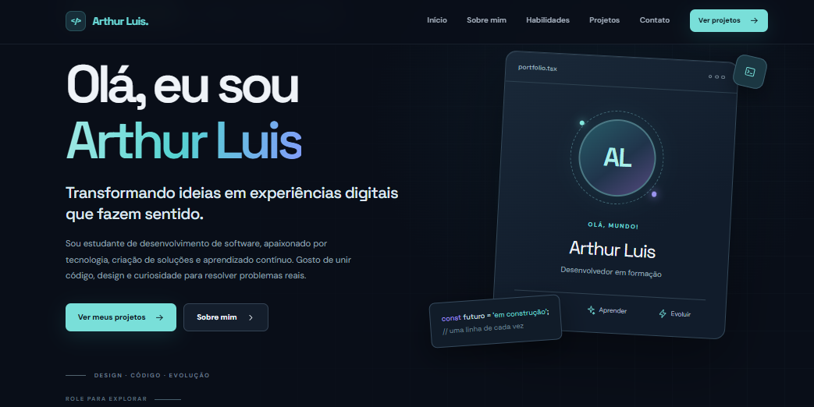
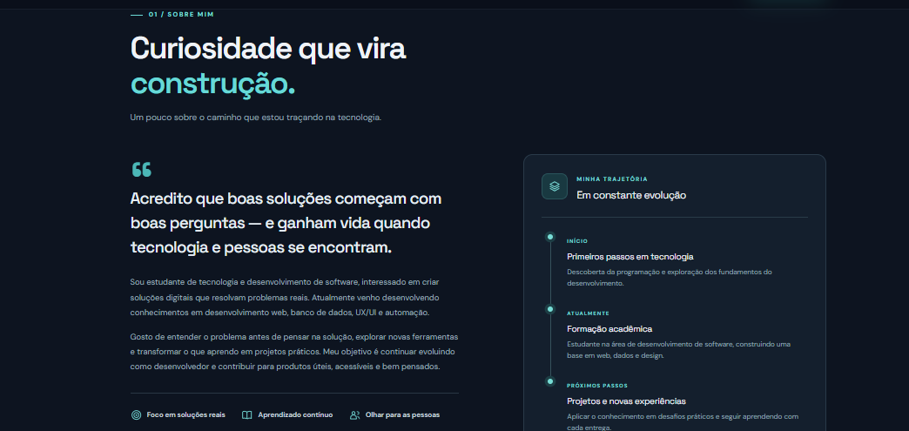
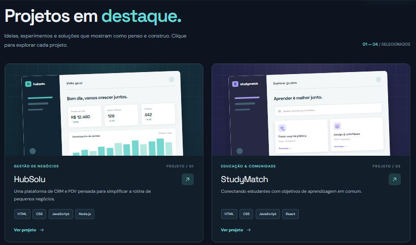

# Portfólio Pessoal

Este projeto consiste na criação de um portfólio pessoal voltado para a área de tecnologia e desenvolvimento de software. O objetivo é apresentar, de forma organizada e visual, minha trajetória, interesses, habilidades e projetos desenvolvidos ao longo da minha formação.

O protótipo desenvolvido no Figma conta com uma apresentação pessoal, seção de habilidades e tecnologias, além de uma área dedicada aos principais projetos. Cada projeto possui uma página própria com informações mais detalhadas sobre seu objetivo, funcionalidades, tecnologias utilizadas e aprendizados.

O portfólio também foi pensado para proporcionar uma navegação simples e intuitiva, com uma estrutura adaptada para diferentes dispositivos, como computador, tablet e celular.

### Conteúdo do Portfólio

* Apresentação e informações pessoais;
* Trajetória e interesses na área de tecnologia;
* Habilidades e tecnologias em desenvolvimento;
* Projetos acadêmicos e pessoais;
* Detalhamento individual dos projetos;
* Navegação entre as diferentes seções do portfólio;
* Layout adaptado para diferentes dispositivos.
## Preview 
 
### Página inicial 
 
 
### Sobre mim
 
 
### Projetos em destaque

### Protótipo no Figma

O projeto completo, incluindo todas as telas e interações desenvolvidas, pode ser acessado pelo link abaixo:

**[Acessar o protótipo no Figma](https://www.figma.com/make/Wi9EgLNx2NvvXQcv4wqAWF/Portfolio-Prototype-for-Developer?t=jxqFidapxRJaDoSK-1&preview-route=%2F%23inicioI_O_LINK_DO_FIGMA)**
git add README.md